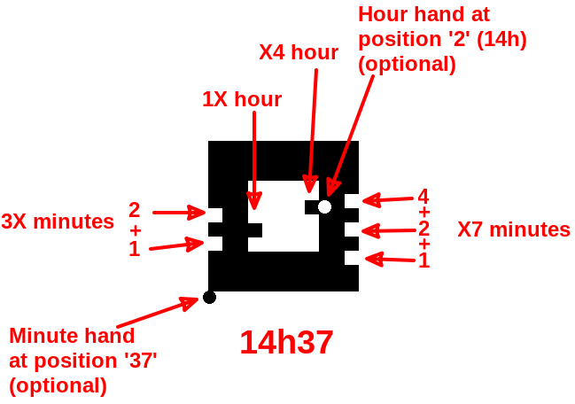

# BinaryBlocks watch face
A binary watchface, using big blocks.

Here is a screenshot showing 14:37.

## Origin
This watchface is the second half of the two watchfaces that https://blog.tokyoflash.com/2015/01/21/square-watch-uses-block-graphic-digits/ inspired me, the other being Squaro.

I used the idea of the numbers imbricated, to display hour and minutes in binary form.

## Features
Display the time as binary, but, each digit at a time, based upon a 24h time.

So the inside binary is the hour, the left side being the first digit, the right the second one. The minutes are on the outside, the same way (tens on the left, unities on the right).  
The binary is displayed with the 1 at the bottom, and the highest power of two at the top.

Here is an explanation of the workings of the watchface.

There are two options. You can alternate between all possibilities with the bottom right button : 
* Light and dark theme
* Showing the classical hands or not. You can indeed choose to display circles representing the hours and minutes hands, in a classical, 12h form. Hours is the one closest to the center.

For funnsies and because I already had the code,  I added a Morse mode. Press the up button, and the watch will vibrate in Morse the time (not the date, it would be a bit too long).  
Decoding Morse time is relatively easy with a bit of practise, and doesn't use your eyes, so might be helpful on some situations.

As a reminder, here is the Morse code used :

* 0 : — — — — —
* 1 : • — — — —
* 2 : • • — — —
* 3 : • • • — —
* 4 : • • • • —
* 5 : • • • • •
* 6 : — • • • •
* 7 : — — • • •
* 8 : — — — • •
* 9 : — — — — •

The time will be vibrating as "XX XX", always two block of two digits, with a space (silent) in between.  
Usually, Morse code is sent at the speed of ~60ms per dot (a dash being three dots). I choose 100ms instead, to facilitate comprehension. Don't thank me :) In any case, it can be easily edited in the code.

## How to use/install
I used PlatformIO.  
You can use `pio run -t upload` to compile and upload the project to your Watchy.

If you don't use PlatformIO, look at the `platformio.ini` to have a list of libs necessary for compilation.

